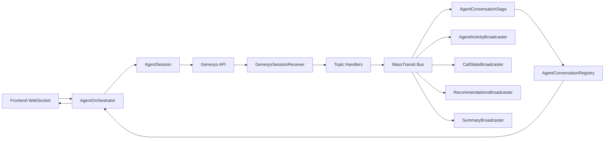
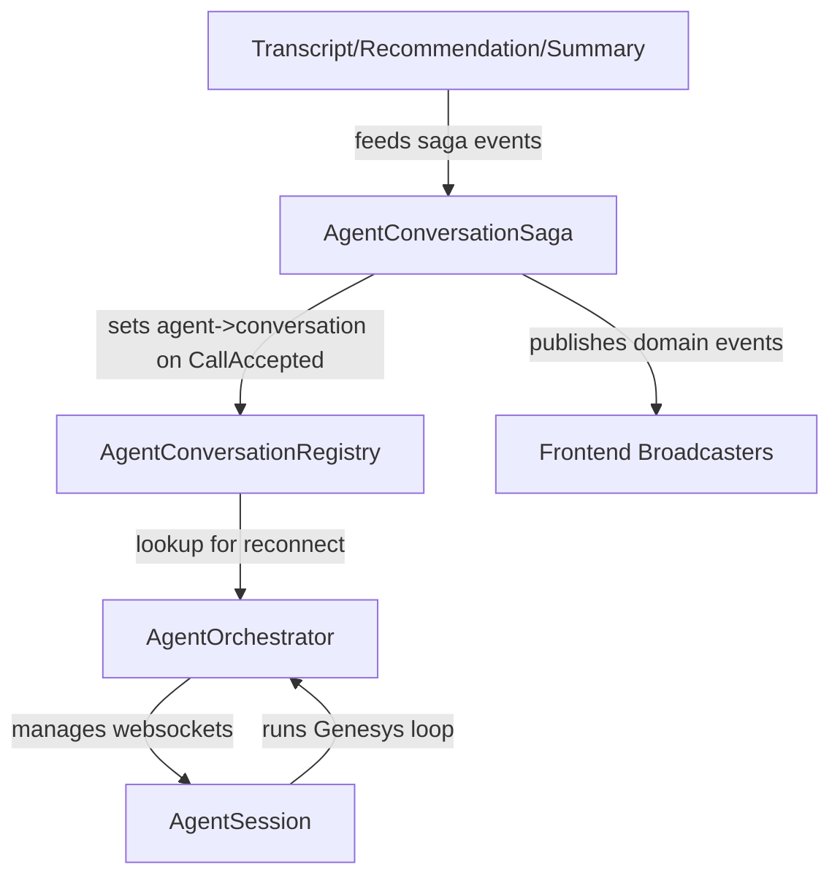
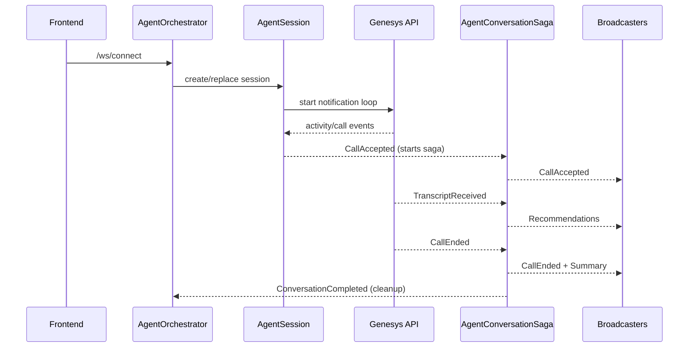
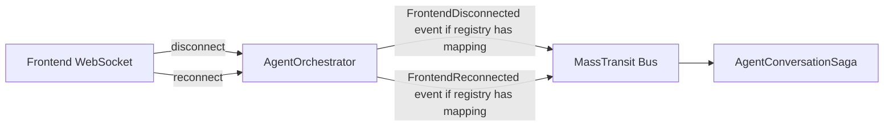

# Conversation Flow (Short)

This folder owns the websocket entry point, Genesys event ingress, conversation saga, agent registry/orchestrator, and frontend broadcasters.

## High-level flow

## Component responsibilities

## Conversation sequence (simplified)

## Reconnect behavior (current)

## Notes

- Saga starts on `CallAccepted`, not on `CallArrived`.
- Conversation events are routed by `AgentId` on the saga events.
- Registry is agent -> conversation only, used for reconnect/session flows.
