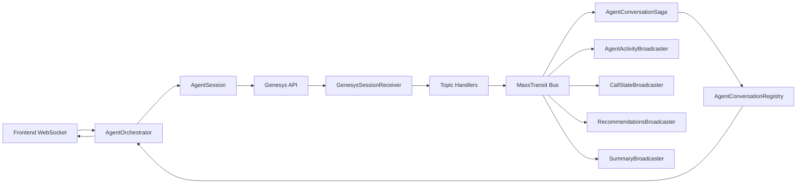
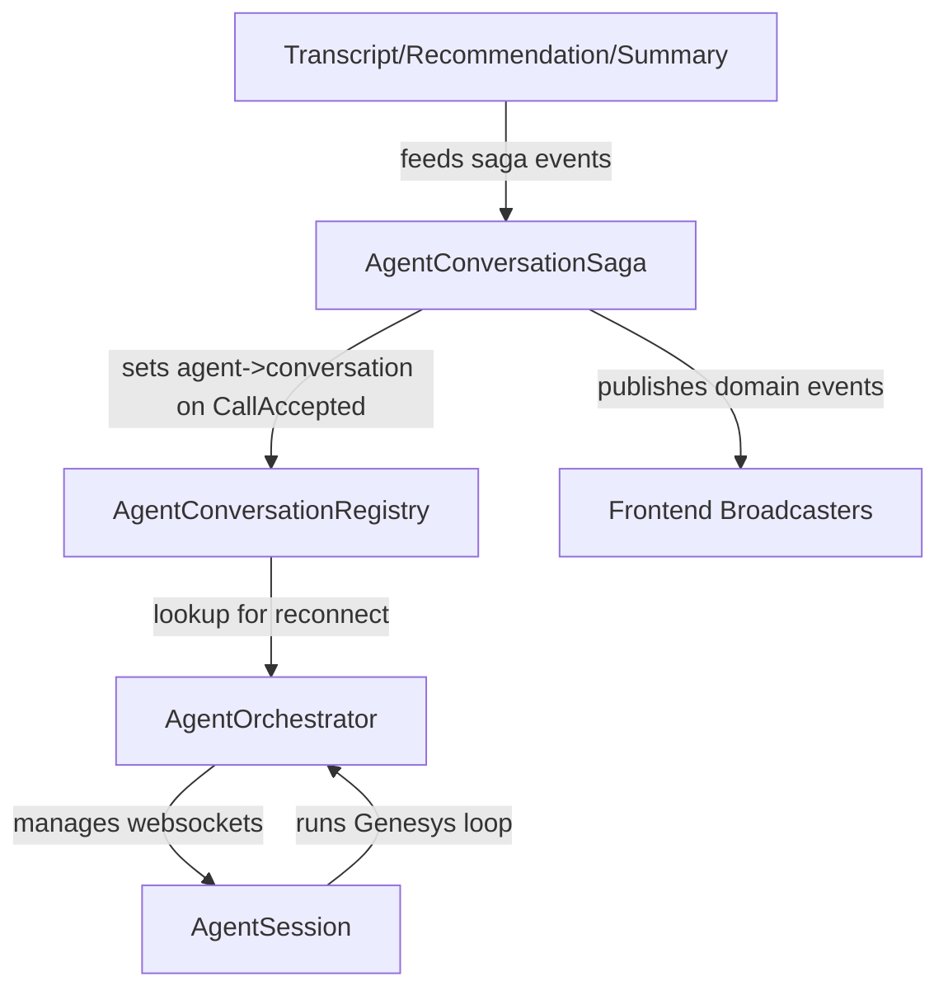
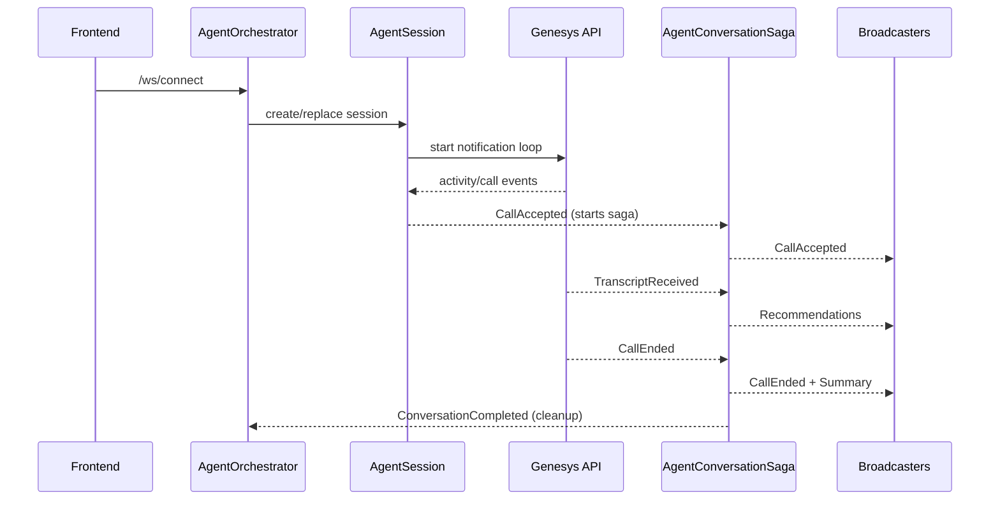
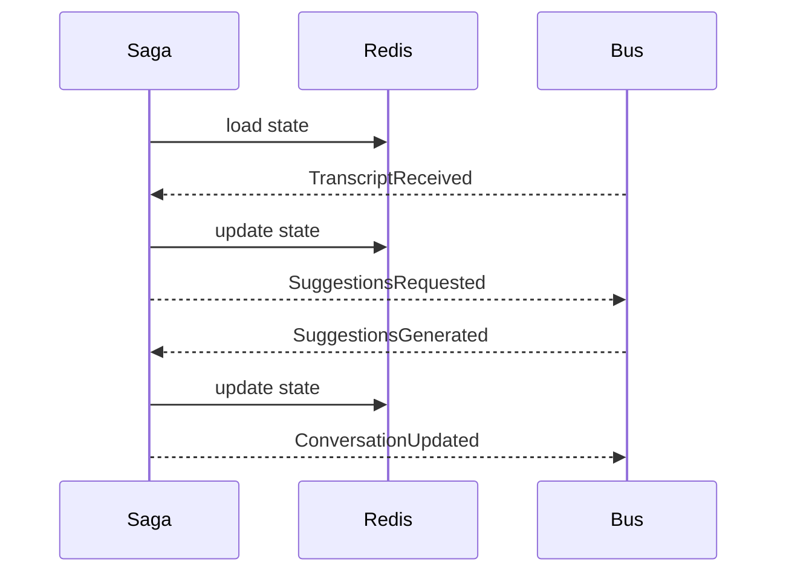
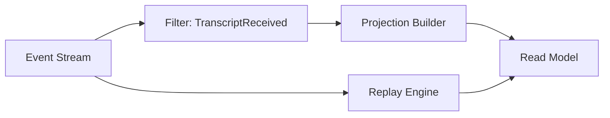

# Event-Driven Design in Practice

Call center AI scenario

---
class: px-12
---

# Outcomes

- Explain events vs commands vs queries
- Model a workflow with event storming
- Design a deterministic saga
- Plan for telemetry, replay, and schema evolution
- Recognize common pitfalls early

---
class: px-12
---

# Agenda (90 min)

- Core concepts (15 min)
- Scenario walkthrough (10 min)
- Event storming with AI (15 min)
- Legacy baseline and refactor goals (10 min)
- New design and telemetry (30 min)
- Downfalls and wrap-up (10 min)

---
layout: section
---

# Core Concepts

---
class: px-12
---

# Events vs Commands vs Queries

| Type | Meaning | Example |
| --- | --- | --- |
| Command | Intent to do | AcceptCall |
| Event | Fact that happened | CallAccepted |
| Query | Ask for state | GetAgentDashboard |

---
class: px-12
---

# What Makes an Event

- Past tense, immutable fact
- Emitted once, consumed many times
- Carries context for replay

---
class: px-12
---

# Core Vocabulary

- Aggregate: consistency boundary
- CorrelationId: tie the flow together
- CausationId: what triggered this

---
layout: section
---

# The Scenario

---
class: px-12
---

# Call Center AI Flow

- Agent receives a call
- Transcript events arrive continuously
- Saga coordinates deterministic flow
- State stored in Redis
- LLM suggestions generated and streamed to frontend

---
class: px-6
---

# High-Level Flow



---
class: px-6
---

# Responsibilities



---
class: px-6
---

# Conversation Sequence (Simplified)



---
layout: section
---

# Event Storming

---
class: px-12
---

# Event Storming Primer

- Start with domain events
- Add commands that cause them
- Add read models for UI needs

---
class: px-12
---

# AI Event Storm (5-10 min)

Prompt: map the call center flow into

- Events
- Commands
- Read models

Output: short list of events + one read model

---
class: px-12
---

# Expected Event Set

- CallArrived
- CallAccepted
- TranscriptReceived
- SuggestionsGenerated
- CallEnded
- SummaryGenerated

---
class: px-12
---

# Read Models

- Agent dashboard summary
- Live transcript view
- Suggestion stream

---
class: px-12
---

# Event Contract Template

- eventId
- occurredAt
- correlationId
- causationId
- aggregateId
- schemaVersion
- payload

---
layout: section
---

# Legacy Baseline

---
class: px-12
---

# The Old Flow

- Synchronous call chain
- Direct dependencies between services
- Hard to replay or audit

---
class: px-12
---

# Legacy Pain Points

- Failures cascade across services
- Debugging requires log spelunking
- No clear ordering or trace view

---
class: px-12
---

# Legacy Code Snapshot

```cs
TODO-VGZ-CODE
```

---
layout: section
---

# Refactor: Event-Driven Design

---
class: px-12
---

# Choreography vs Orchestration

| Style | Strength | Risk |
| --- | --- | --- |
| Choreography | Flexible, decoupled | Hard to see flow |
| Orchestration | Deterministic | Central coordination |

---
class: px-12
---

# Saga for Determinism



---
class: px-12
---

# Streams vs Queues

| Topic | Streams | Queues |
| --- | --- | --- |
| Ordering | Per partition | Per queue |
| Replay | First class | Manual |
| Fanout | Native | Requires duplication |

---
class: px-12
---

# Frontend Streaming

- SuggestionsGenerated -> WebSocket broadcaster
- Agent UI consumes a single read model

---
class: px-12
---

# Dotnet Example: Consumer

```cs
TODO-VGZ-CODE
```

---
class: px-12
---

# Dotnet Example: Saga State

```cs
TODO-VGZ-CODE
```

---
class: px-12
---

# Telemetry and Tracing

- CorrelationId across all events
- Trace consumer latency per event type
- Aggregate by conversationId

---
class: px-12
---

# Telemetry Found Real Bugs

- Out-of-order transcripts caused stale suggestions
- Duplicate events from retries inflated counts
- Trace view showed the exact hop and delay

---
class: px-6
---

# Event Sourcing and Replay



---
class: px-12
---

# Replay Safety Checklist

- Side effects isolated
- Idempotency keys in handlers
- Backfill windows defined

---
layout: section
---

# Downfalls

---
class: px-6
---

# Complexity Shows Up Fast

```text
Conversation
├── AgentConversation
│   ├── AgentConversationEvents.cs
│   ├── AgentConversationSaga.cs
│   ├── AgentConversationSagaDefinition.cs
│   └── States.cs
├── ConversationCleanup
│   └── ConversationCleanup.cs
├── Core
│   ├── AgentConversationRegistry.cs
│   ├── ConversationCorrelationId.cs
│   ├── ConversationEvent.cs
│   └── ConversationTypes.cs
├── FrontendCommunication
│   ├── Agent
│   │   ├── AgentActivityBroadcaster.cs
│   │   ├── AgentCallArrivedBroadcaster.cs
│   │   └── FrontendMessages.cs
│   ├── Conversation
│   │   ├── CallAcceptedBroadcaster.cs
│   │   ├── CallEndedBroadcaster.cs
│   │   ├── FrontendMessages.cs
│   │   ├── RecommendationsBroadcaster.cs
│   │   └── SummaryBroadcaster.cs
│   └── Core
│       ├── BroadcasterBase.cs
│       └── Messages.cs
├── GenesysNotifications
│   ├── GenesysNotificationEvents.cs
│   ├── GenesysNotificationHandler.cs
│   ├── GenesysNotificationSessionState.cs
│   ├── GenesysOrchestrator.cs
│   ├── Session
│   │   ├── GenesysSessionConnector.cs
│   │   └── GenesysSessionReceiver.cs
│   └── TopicHandlers
│       ├── GenesysActivityTopicHandler.cs
│       ├── GenesysCallsTopicHandler.cs
│       ├── GenesysConversationsTopicHandler.cs
│       ├── GenesysTranscriptionTopicHandler.cs
│       └── IGenesysTopicHandler.cs
├── Orchestration
│   ├── AgentOrchestrator.cs
│   ├── FrontendSessionTerminator.cs
│   ├── OrchestrationContracts.cs
│   └── Session
│       ├── AgentSession.cs
│       ├── FrontendCycle.cs
│       └── GenesysLoop.cs
├── README.md
├── RegisterDependencies.cs
├── Tracing
│   ├── ConversationTraceContext.cs
│   └── TraceContextConsumeFilter.cs
└── Transcripts
    ├── ConversationTranscriptStore.cs
    ├── RecommendationGenerator
    │   ├── BasisvraagRecommendation.cs
    │   └── RecommendationGenerator.cs
    ├── RecommendationsGenerated.cs
    ├── SummaryGenerator
    │   └── SummaryGenerator.cs
    └── TranscriptUpdater.cs
```

---
class: px-12
---

# Common Pitfalls

- Hidden coupling via naming
- Debugging async timing issues
- Over-using events for CRUD
- Ignoring ordering guarantees

---
layout: section
---

# Wrap-Up

---
class: px-12
---

# Key Takeaways

- Events make intent visible
- Sagas keep flows deterministic
- Telemetry and replay are first-class wins
- Complexity is real, design for it

---
class: text-center
---

# Q and A
