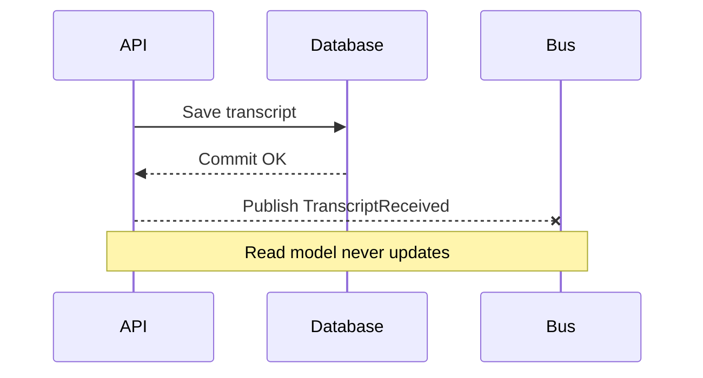
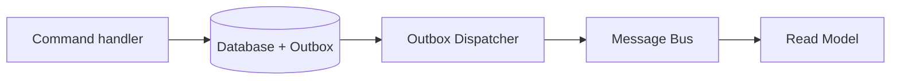
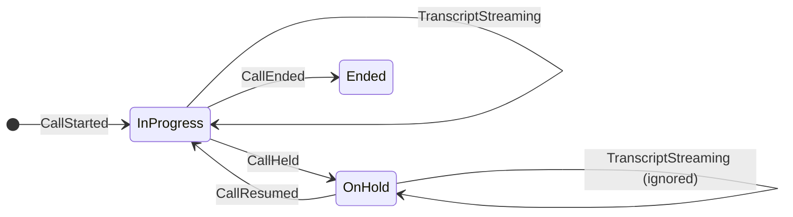

# Event-Driven Design with Aimy

Call center AI scenario

---
layout: section
---

# Aimy

---
class: px-12
---

# What Aimy Does

- Agent accepts a call
- Transcript segments stream in
- Aimy turns transcripts into next-best actions
- Call lifecycle events update the UI in near real time

---
layout: section
---

# Legacy: websocketv3

---
class: px-12
---

# Problems with websocketv3

- Did too much: ingress, orchestration, state, and UI pushes
- Semi-linear flow with hidden branching and retries
- Hard to reason about ordering and ownership

---
class: px-12
---

# What It Caused

- Bugs surfaced far from the real cause
- No single place to see call state
- Debugging meant log spelunking across services

---
layout: section
---

# Introducing
# Event-Driven Architecture

---
class: px-12
---

# CQRS in One Minute

| Concern | Write Model | Read Model |
| --- | --- | --- |
| Purpose | Enforce invariants | Serve queries fast |
| Storage | Normalized | Denormalized |
| Updated by | Commands | Events / projections |
| Consistency | Immediate | Eventual |

When the read model updates via events, consistency becomes eventual.
---
class: px-12
---

# Events vs Commands vs Queries

| Type | Meaning | Example |
| --- | --- | --- |
| Command | Intent to do | AcceptCall |
| Event | Fact that happened | CallAccepted |
| Query | Ask for state | GetAgentDashboard |

---
class: px-12
---

# Smaller Contracts, Better Queries

- Events carry facts, not full documents
- Queries resolve data for the UI shape
- Projections are for representation

---
layout: section
---

# Demo 1: CQRS + Events Inconsistency

---
class: px-12
---

# What Just Happened

---
layout: section
---

# Eventual Consistency + Outbox

---
class: px-12
---

# Why Eventual Consistency Works

- If recovery is reliable and observable
- If user impact is controlled
- If you can replay or retry safely

---
class: px-6
---

# Outbox Pattern (Simplified)

---
layout: section
---

# Exercise 1

---
class: px-12
---

# Exercise 1: Add the Outbox

Goal: make `TranscriptReceived` reliable after the write.

Done when:
- Transcript saves successfully
- Event lands in outbox on failure
- Dispatcher publishes later
- Dashboard catches up

Branch: `exercise-1-outbox`

---
layout: section
---

# Saga Orchestration

---
class: px-12
---

# Why Sagas Here

- The call lifecycle has real state
- Events can arrive late or duplicate
- One place must decide the outcome

---
class: px-6
---

# Call Resolution Saga (Baseline)

---
layout: section
---

# Exercise 2

---
class: px-12
---

# Exercise 2: Ignore Transcripts on Hold

Build a saga that pauses transcript handling while the call is on hold.

Done when:
- Call enters `OnHold` on `CallHeld`
- `TranscriptStreaming` is ignored during hold
- Processing resumes on `CallResumed`

Branch: `exercise-2-saga`

---
layout: section
---

# Telemetry

---
class: px-12
---

# What Good Telemetry Answers

- Where is this call right now?
- Which event triggered this?
- What was retried?
- Which hop was slow?

---
class: px-12
---

# Telemetry for Aimy

- CorrelationId across all events
- CausationId per handler hop
- Trace spans for consumers and outbox dispatch
- Per-call dashboards over time

---
layout: section
---

# Bug Stories

---
class: px-12
---

# Bug 1: Stale Suggestions

- Symptom: suggestions lagged behind transcript
- Telemetry: out-of-order events on a single call
- Fix: enforce ordering + idempotent projection

---
class: px-12
---

# Bug 2: Duplicate CallAccepted

- Symptom: two active conversations for one agent
- Telemetry: duplicate CallAccepted from retry loop
- Fix: saga idempotency + correlation guard

---
class: text-center
---

# Q and A
